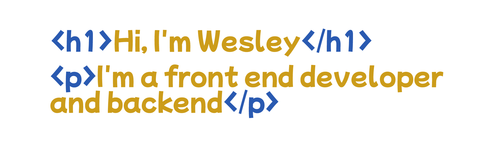

# 

##### 
## Formação:
###### Formado em Técnico em Ánalise e Desenolvimento de Sistemas e alguns cursos online como Design de Interfaces e Desenovilmento WEB.
## Estudando no momento:
###### Sim, estou estudando Ánalise e Desenvolvimento de Sistemas (Tecnólogo), além de estar estudando a parte JavaScript e TypeScript voltado pra Angular e React
## Experiência profissional
##### Sou novo na área da programação e tbalho na área praticamente 1 ano 2020/2021, sou WEb Designer e estou na busca de me tornar um Desenvolvedor Júnior.
## Futuro?
##### Pretendo me especializar na área da Tecnologia, e aprender tudo que puder.
##### 
* Photoshop
* HTML 5
* CSS 3
* JavaScript
* JQuery
* PHP
* GIT
* GitHub

##### 
* Bootstrap
* CodeIgniter v4+

##### 
* AJAX
* TypeScript
* Angular
* React
* NPM

