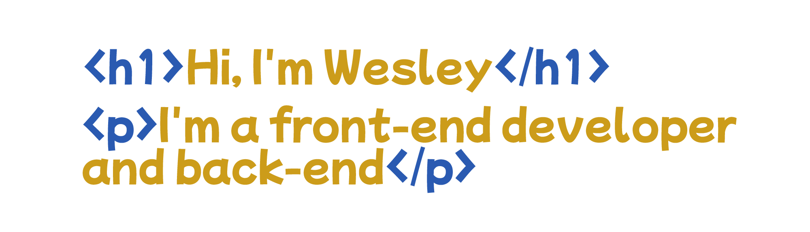

# 

## Formação:
###### Formado em Técnico em Ánalise e Desenolvimento de Sistemas (Etec) e alguns cursos online como Design de Interfaces e Desenovilmento WEB (Udemy).
## Estudando no momento:
###### Sim, estou estudando Ánalise e Desenvolvimento de Sistemas (Tecnólogo  na Uniso), além de estar estudando a parte: JavaScript e TypeScript voltado pra Angular e React
## Experiência profissional
###### Sou novo na área da programação trabalho na área praticamente 1 ano 2020/2021, sou WEB Designer e estou na busca de me tornar um Desenvolvedor Júnior.
## Futuro?
###### Pretendo me especializar na área da Tecnologia, e aprender tudo que puder.
### Habilidades:
* Photoshop
* HTML 5
* CSS 3
* JavaScript
* JQuery
* PHP
* Xamarim.Forms
* C#
* SQL
* MySQL
* TOTVS -RM Portal

  ### Ferramentas:
  * Visual Studio Code
  * Visual Studio
  * XAMPP
  * Pacote Adobe
  * Azure
  * Git
  * GitHUb
  * Máquina virtual
  * FileZilla
  * Reporting Services
  * Canva

### Frameworks e Library:
* Bootstrap
* CodeIgniter v4+

### Aprendendo:
* AJAX
* TypeScript
* Angular
* React
* Next.js
* NPM
* YARN

